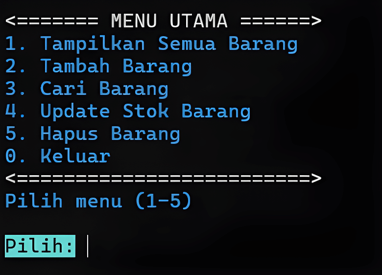

# Warehouse Inventory System

<div style="text-align: center;">
    
</div>

A command-line warehouse inventory management system built with C++.  Features CRUD operations for item management including view items in table  format, add new items, search items, update stock levels, and delete items  with JSON-based data persistence.

## Installation Guide
Installation procedure using CMD: 
1. Download CMake to manage cross-platform build processes and install it after downloading:
```text
https://cmake.org/download/
```
2. Clone the repository onto your local machine:
```bash
git clone https://github.com/Fahreja-Dev/Warehouse-Inventory-System
```
3. Then enter the project directory with the command:
```cmd
cd Warehouse-Inventory-System
```
4. Create a folder named `build`, type the command:

```cmd
mkdir build
```
5. Go to the build folder, type the command:
```cmd
cd build
```
6. Next, read the `CMakeLists.txt` file in the root directory and create a build file in the current directory by typing the command:
```cmd
cmake ..
```
7. Run the `build` compilation process based on the configuration file previously created by `cmake ..`, type the command:
```cmd
cmake --build .
```
8. Then open the root directory of the project and run the application named `AplikasiGudang.exe`.